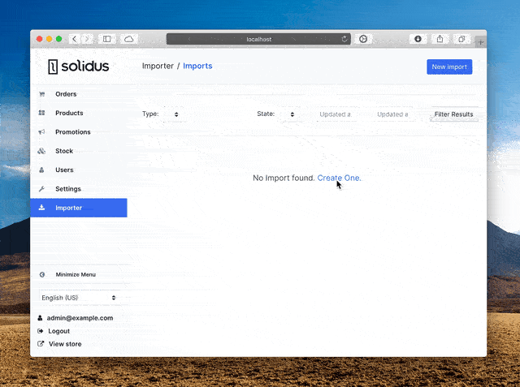
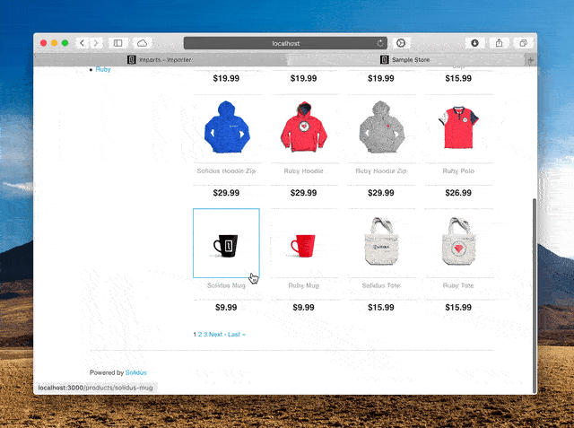

# Solidus Importer

This extension aims to create a component to import data from other popular
e-commerce solutions to Solidus.

## Installation

Add solidus_importer to your Gemfile:

```ruby
gem 'solidus_importer'
```

Bundle your dependencies and run the installation generator:

```shell
bin/rails generate solidus_importer:install
```

## Usage

The imports can be fully managed from the backend UI, following progress (image processing can take a few seconds for each image).





### From the console

Sample code to import some products:

```ruby
SolidusImporter.import! 'some_path/sample_products.csv', type: :products
```

### Accepted Format

The accepted format is the [Shopify CSV](https://help.shopify.com/en/manual/products/import-export/using-csv) for which is also relatively easy to find exporters for every major platform (e.g. [shopify_transporter](https://github.com/Shopify/shopify_transporter)).

There are three supported CSV types:

1. [Product](https://help.shopify.com/en/manual/migrating-to-shopify/transporter-app/csv-products)
2. [Order](https://help.shopify.com/en/manual/migrating-to-shopify/transporter-app/csv-orders)
3. [Customer](https://help.shopify.com/en/manual/migrating-to-shopifsy/transporter-app/csv-customers)


---

Alternatively, we accept CSV files that conform to the ones shown in the [examples/csvs](https://github.com/solidusio-contrib/solidus_importer/tree/master/examples) folder

### The Processors

The importing is managed by a list of processors for each CSV type, the default processors are:

```rb
customers: {
  importer: SolidusImporter::BaseImporter,
  processors: [
    SolidusImporter::Processors::Address,
    SolidusImporter::Processors::Customer,
    SolidusImporter::Processors::Log
  ]
},
orders: {
  importer: SolidusImporter::BaseImporter,
  processors: [
    SolidusImporter::Processors::Order,
    SolidusImporter::Processors::Log
  ]
},
products: {
  importer: SolidusImporter::BaseImporter,
  processors: [
    SolidusImporter::Processors::Product,
    SolidusImporter::Processors::Variant,
    SolidusImporter::Processors::OptionTypes,
    SolidusImporter::Processors::OptionValues,
    SolidusImporter::Processors::ProductImages,
    SolidusImporter::Processors::VariantImages,
    SolidusImporter::Processors::Log
  ]
}
```

Each processor is a callable that will accept a context Hash. It will perform its function within the `#call(context)` method and will return an equally valid context Hash. The returned context can be augmented with additional data.

Example:

```rb
CUSTOM_LOGGER = Logger.new(Rails.root.join('log/importer.log'))
CustomLoggerProcessor = ->(context) {
  context.merge(logger: CUSTOM_LOGGER)
}
# Replace the original Log processor with CustomLoggerProcessor
SolidusImporter::Config.solidus_importer[:customers][:processors].map! do |processor|
  if processor == 'SolidusImporter::Processors::Log'
    'CustomLoggerProcessor'
  else
    processor
  end
end
```

Each list of processors can be configured to add, remove, or replace any of the default processors.

### Advanced Configuration

To define your own processors (in this example for products), add to the spree
initializer:

```ruby
SolidusImporter::Config[:solidus_importer] = {
  products: {
    importer: SolidusImporter::Importers::Products,
    processors: [
      SolidusImporter::Processors::Product,
      SolidusImporter::Processors::Variant,
      SolidusImporter::Processors::Log
    ]
  }
}
```

The `importer` class is responsible of the whole import process of a single
source file. The `processors` classes are responsible of the import of a single
row of the source file; every processor has a `call` method (with an input
`context`) which makes a specific action and updates the context if needed.

## Development

### Testing the extension

First bundle your dependencies, then run `bin/rake`. `bin/rake` will default to building the dummy
app if it does not exist, then it will run specs. The dummy app can be regenerated by using
`bin/rake extension:test_app`.

```shell
bin/setup
bin/rake
```

To run [Rubocop](https://github.com/bbatsov/rubocop) static code analysis run

```shell
bundle exec rubocop
```

When testing your application's integration with this extension you may use its factories.
Simply add this require statement to your spec_helper:

```ruby
require 'solidus_importer/factories'

```

### Running the sandbox

To run this extension in a sandboxed Solidus application, you can run `bin/sandbox`. The path for
the sandbox app is `./sandbox` and `bin/rails` will forward any Rails commands to
`sandbox/bin/rails`.

Here's an example:

```shell
$ bin/rails server
=> Booting Puma
=> Rails 6.0.2.1 application starting in development
* Listening on tcp://127.0.0.1:3000
Use Ctrl-C to stop
```

### Updating the changelog

Before and after releases the changelog should be updated to reflect the up-to-date status of
the project:

```shell
bin/rake changelog
git add CHANGELOG.md
git commit -m "Update the changelog"
```

### Releasing new versions

Please refer to the dedicated [page](https://github.com/solidusio/solidus/wiki/How-to-release-extensions) on Solidus wiki.

## License

Copyright (c) 2020 Nebulab SRLs, released under the New BSD License
